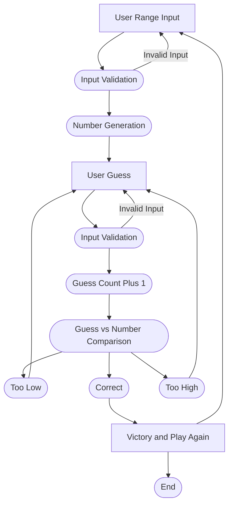

#Flowchart desciption  
1. Game will open with a prompt for the user to define the range of numbers it will generate a number inside of.  
2. User will input the range. Game will validate the imput as valid or invalid and then proceed or re-prompt range input.  
3. Game will generate the number to be guessed. User is prompted to make a guess.  
4. Used will enter a guess. Input validation and then the game will proceed or re-prompt the guess input.  
5. If the input was valid the guess count will increase by 1, the game will compare the guess and the answer, and display the result of the comparison.  
6. If the guess is too low or high the game loops back to the User Guess step.  
7. If the guess is correct the game will display a victory screen, the number of guesses to win, and then prompt if the user would like to play again.  
8. Game will end, or will loop back to the User range input.