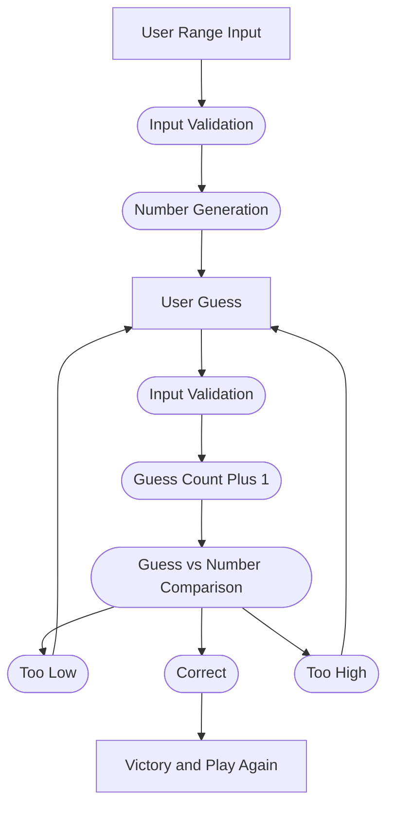

```mermaid
flowchart TD
A[User Range Input] -->B([Input Validation])
    B --> C([Number Generation])
    C --> D[User Guess]
    D --> E([Input Validation])
    E --> F([Guess Count Plus 1])
    F --> G([Guess vs Number Comparison])
    G --> H([Too Low])
    G --> I([Correct])
    G --> J([Too High])
    H --> D
    J --> D
    I --> K[Victory and Play Again]
```
